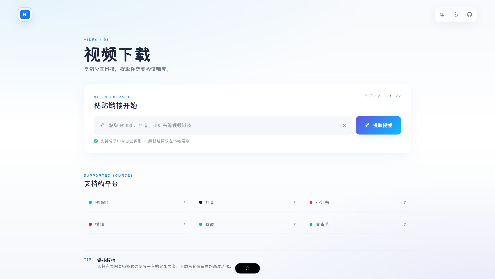
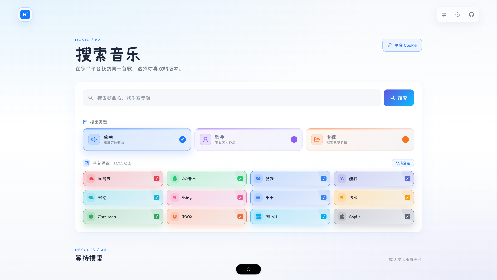

# media-dl

用 Go 实现的轻量 CLI：解析多平台分享链接并下载视频，也支持聚合音乐搜索与下载。视频协议参考 [yt-dlp](https://github.com/yt-dlp/yt-dlp)、[you-get](https://github.com/soimort/you-get) 与 [dy-cli](https://github.com/Youhai020616/douyin)，按接口重写，而非翻译 Python；音乐能力基于 [guohuiyuan/music-lib](https://github.com/guohuiyuan/music-lib)。

## Web UI





## 构建

本机（当前系统 / 架构）：

```bash
go build -o media-dl .
```

安装到本机全局（写入 `$GOPATH/bin`，需确保该目录已在 `PATH` 中；二进制名取自模块路径最后一段 `media-dl`）：

```bash
go install .
```

之后可在任意目录直接使用 `media-dl`；代码更新后重新执行一次即可。

交叉编译 Linux（纯 Go，无需本机交叉工具链；`CGO_ENABLED=0` 保证静态链接）：

```bash
# amd64（常见 x86_64 服务器 / 云主机）
CGO_ENABLED=0 GOOS=linux GOARCH=amd64 go build -o ./dist/media-dl-linux-amd64 .

# arm64（ARM 服务器、树莓派 64 位、Apple Silicon 上的 Linux 等）
CGO_ENABLED=0 GOOS=linux GOARCH=arm64 go build -o ./dist/media-dl-linux-arm64 .
```

依赖：Go 1.25.10+。命令行由 [Cobra](https://github.com/spf13/cobra) 提供；音乐平台适配依赖开源项目 [guohuiyuan/music-lib](https://github.com/guohuiyuan/music-lib)。B 站 DASH 分离流、优酷/爱奇艺/腾讯的 HLS 或多段视频，合并时需要本机已安装 `ffmpeg`。

## HTTP API 和 Web UI

除了 CLI，项目还提供 `media-dl server` HTTP 服务。服务端使用开源项目 [olympus/httpserver](https://github.com/ihezebin/olympus) 注册 API 和 OpenAPI 文档，音乐接口继续使用 [guohuiyuan/music-lib](https://github.com/guohuiyuan/music-lib) 的平台实现；构建后的 `webui` 由同一服务托管。

```bash
go run . server --port 8080 --web-dir ./webui/dist
```

服务启动后，Web UI 地址为 `http://127.0.0.1:8080/`，接口文档为 `http://127.0.0.1:8080/openapi`。完整接口、请求体、响应体和环境变量说明见 [HTTP API 文档](./httpserver/README.md)。

如果只需要提供 HTTP API、不需要启动 Web UI，可使用 `--api-only`：

```bash
go run . server --api-only --port 8080
```

此模式不托管 Web UI 静态文件，也不会注册 Web UI 的验证码接口和带验证码接口：`/api/captcha`、`/api/captcha/verify`、`/api/music/search/verified`、`/api/video/info/verified`。普通 HTTP API、在线下载接口和 OpenAPI 文档仍可用；`--web-dir` 在此模式下会被忽略。也可以通过 `MEDIA_DL_API_ONLY=true` 开启。

## 本地一键部署

如果不使用 Docker，选择本机直接运行方式。需要先构建前端和 Go 服务，再启动服务：

```bash
make build
make server
```

如果使用 Docker Compose，则不需要先执行 `make build` 或 `make server`。直接执行 `make docker-up` 即可；Compose 会在镜像构建过程中自动构建前端和 Go 服务，下载请求由服务端在线返回：

```bash
make docker-up
```

`make docker-up` 实际使用 [docker-compose.local.yml](./docker-compose.local.yml)，默认访问 `http://127.0.0.1:8080/`，停止服务执行 `make docker-down`。也可以直接执行：

```bash
docker compose -f docker-compose.local.yml up --build
```

可通过 `MEDIA_DL_PORT`、`MEDIA_DL_PROXY`、`MEDIA_DL_COOKIE`、`MEDIA_DL_COOKIES` 和 `MEDIA_DL_API_ONLY` 配置端口、代理、登录态及是否仅启动 API，例如：

```bash
MEDIA_DL_PORT=8090 MEDIA_DL_PROXY=http://host.docker.internal:7890 make docker-up
```

## 服务器 Docker 镜像 tag 部署

服务端不需要拉取或编译源代码，只运行镜像仓库中的 tag。默认镜像地址为腾讯云 `ccr.ccs.tencentyun.com/hezebin/media-dl`，可以通过 `DOCKER_REGISTRY`、`DOCKER_NAMESPACE` 或 `IMAGE_REPOSITORY` 覆盖。镜像内已经包含 Go 后端和编译后的 `webui` 前端，由同一个 `media-dl server` 进程提供服务。

### 1. `make package` 构建并推送镜像

建议在仓库的 GitHub tag 上执行打包，例如：

```bash
git checkout v0.1.0
docker login ccr.ccs.tencentyun.com
make package
```

`make package` 会读取当前仓库 tag 作为镜像 tag：

```text
ccr.ccs.tencentyun.com/hezebin/media-dl:v0.1.0
```

它会完成前端构建、后端构建、Docker 镜像构建和推送。当前提交没有 Git tag 时，会使用 Git 提交号作为 tag；生产部署建议使用 GitHub 仓库中已经存在的版本 tag。构建架构默认是 `linux/amd64`，可通过 `DOCKER_PLATFORM` 覆盖。只构建不推送时使用 `make package-local`。

如果不想提前执行 `docker login`，也可以把镜像仓库账号和访问令牌交给 Makefile，由它自动完成登录：

```bash
DOCKER_REGISTRY=ccr.ccs.tencentyun.com \
DOCKER_USER=<账号> \
DOCKER_PWD=<访问令牌> \
make package
```

### 2. 服务器直接启动 Compose

将 [docker-compose.yml](./docker-compose.yml) 和一个 `.env` 文件放到云服务器的部署目录；不需要复制项目源代码或 Dockerfile：

```dotenv
MEDIA_DL_TAG=v0.1.0
MEDIA_DL_PORT=8080
MEDIA_DL_PROXY=
MEDIA_DL_COOKIE=
MEDIA_DL_COOKIES=
MEDIA_DL_API_ONLY=false
```

`MEDIA_DL_TAG` 使用 GitHub 仓库中发布的 tag，并且必须与 `make package` 推送的镜像 tag 一致。私有腾讯云仓库需要先在服务器登录：

```bash
docker login ccr.ccs.tencentyun.com
docker compose pull
docker compose up -d
docker compose ps
```

升级时只需把 `.env` 中的 `MEDIA_DL_TAG` 改为新的 GitHub tag，再执行 `docker compose pull && docker compose up -d`。下载请求由服务端在线返回，不需要挂载下载目录，查看日志或停止服务：

```bash
docker compose logs -f media-dl
docker compose down
```

根目录的 [docker-compose.yml](./docker-compose.yml) 是云服务器的 tag 部署配置；本地源码构建使用 [docker-compose.local.yml](./docker-compose.local.yml)。

## 总览

视频命令：

```text
media-dl video <command> <platform> <url> [flags]
```

音乐命令：

```text
media-dl music search [keyword] [flags]
media-dl music download <platform> <url> [flags]
```

### 代码结构

```text
internal/
  music/                  音乐搜索、平台适配封装和歌曲下载
  video/
    extractor/            视频平台解析器
    model/                视频统一信息模型
    downloader/           视频文件下载和 ffmpeg 合并
  httpx/                  视频和音乐共用的 HTTP、Cookie、代理能力
  util/                   视频和音乐共用的文件名等工具
httpserver/               HTTP API、文件服务和 webui 托管
webui/                    Vite + React 前端
```

## 公共参数（video / music / server）

以下参数是根命令的持久参数，`video info`、`video download`、`music search`、`music download`、`server` 均可使用。它们的参数名相同，但在三个命令域中的注入方式略有不同。

| 参数         | 默认值 | video 行为                                                                                                  | music 行为                                                                                                      | server 行为                                         |
| ------------ | ------ | ----------------------------------------------------------------------------------------------------------- | --------------------------------------------------------------------------------------------------------------- | --------------------------------------------------- |
| `--proxy`    | 空     | 通过视频 HTTP 客户端代理解析、下载、封面和 DASH/HLS 请求。                                                  | 配置 `music-lib` 和音乐下载使用的 HTTP transport，影响搜索、歌曲解析、下载、封面和歌词请求。                    | 服务启动后，API 请求沿用该代理。                    |
| `--cookies`  | 空     | 读取 Netscape 格式 `cookies.txt`，按 Cookie 的域名和路径规则注入视频请求，用于登录态、VIP、412 和风控场景。 | 读取同一文件，将 Cookie 传入音乐库；音乐页面、音频和封面请求也使用对应 Cookie。                                 | 服务启动时加载文件，后续 video/music API 请求共用。 |
| `--cookie`   | 空     | 将直接传入的 `Cookie` 头复制到支持的视频平台域名，用于临时登录态、VIP 或风控调试。                          | 将原始 `Cookie` 头传入音乐库和音乐 HTTP 请求；Apple Music 可传 `media-user-token`，也可传音乐库支持的 `token`。 | 服务启动时保存该值，后续 API 请求共用。             |
| `-h, --help` | —      | 显示当前 video 命令或子命令帮助。                                                                           | 显示当前 music 命令或子命令帮助。                                                                               | 显示 HTTP 服务参数帮助。                            |

`--cookie` 和 `--cookies` 可以同时传入；实现会合并两者。Cookie 通常具有时效性，使用浏览器导出的登录态时不要提交到 Git。

### `server` 参数

| 参数 | 默认值 | 说明 |
| --- | --- | --- |
| `-P, --port` | `8080`（`MEDIA_DL_PORT`） | HTTP 服务端口 |
| `--web-dir` | `./webui/dist`（`MEDIA_DL_WEB_DIR`） | WebUI 构建目录；API-only 模式下忽略 |
| `--api-only` | `false`（`MEDIA_DL_API_ONLY`） | 仅启动 HTTP API，不注册 WebUI 和验证码相关接口 |

错误信息：video `info` 将失败信息写到 stdout JSON 的 `err_msg`（`success: false`），进程非 0 退出；video/music 下载过程信息写到 **stderr**；music `search` 输出 JSON，部分平台失败时会保留在 `errors` 字段。

## 音乐功能

音乐命令统一以 `media-dl music` 开头，由开源项目 `github.com/guohuiyuan/music-lib` 提供平台适配。本项目负责命令参数、跨平台聚合、Cookie/代理传递、文件保存和酷狗扩展链接转换。

| 平台值     | 平台名称    | 常用别名            |
| ---------- | ----------- | ------------------- |
| `netease`  | 网易云音乐  | `163`、`网易云音乐` |
| `qq`       | QQ音乐      | `qqmusic`、`QQ音乐` |
| `kugou`    | 酷狗音乐    | `酷狗音乐`          |
| `kuwo`     | 酷我音乐    | `酷我音乐`          |
| `migu`     | 咪咕音乐    | `咪咕音乐`          |
| `fivesing` | 5sing       | `5sing`             |
| `qianqian` | 千千音乐    | `千千音乐`          |
| `soda`     | 汽水音乐    | `汽水音乐`          |
| `jamendo`  | Jamendo     | `Jamendo音乐`       |
| `joox`     | JOOX        | `JOOX音乐`          |
| `bilibili` | Bilibili    | `bili`              |
| `apple`    | Apple Music | `applemusic`        |

### `music search` — 搜索歌曲

不传 `--platform` 时，会并发搜索上表中的全部平台；传入后只搜索指定平台。歌手和歌名可以分别通过参数传入，也可以直接使用一个关键词。

```bash
# 搜索所有平台
./media-dl music search "周杰伦 晴天"

# 按歌手和歌名搜索所有平台
./media-dl music search --artist "周杰伦" --title "晴天"

# 只搜索网易云和 QQ 音乐
./media-dl music search --platform netease,qq "周杰伦 晴天"

# 平台也支持中文名，限制每个平台返回数量
./media-dl music search -p 网易云音乐 -l 5 --singer "周杰伦" -t "晴天"
```

#### 酷狗登录 Cookie 搜索

如果 Chrome 已经登录酷狗，可以复制浏览器当前请求使用的完整 Cookie，再传给 `--cookie`。打开酷狗页面后按 `F12`（macOS Chrome 为 `⌥⌘I`）打开开发者工具，进入 **Network / 网络**，刷新页面或播放歌曲，选择一个 `kugou.com` 请求，在 **Headers / 标头 → Request Headers / 请求标头** 中复制 `Cookie` 的完整值。

下面的写法不会把 Cookie 直接写进命令历史：执行 `read` 后，在隐藏输入中粘贴 Cookie 并回车。

```bash
read -r -s KUGOU_COOKIE
echo

./media-dl music search -p kugou "太阳之子" \
  --cookie "$KUGOU_COOKIE"

unset KUGOU_COOKIE
```

也可以使用导出的 Netscape 格式 Cookie 文件：

```bash
./media-dl music search -p kugou "太阳之子" --cookies cookies.txt
```

参数：

| 参数                        | 默认值   | 说明                                             |
| --------------------------- | -------- | ------------------------------------------------ |
| `[keyword]`                 | 空       | 通用搜索关键词，可与 `--artist` / `--title` 组合 |
| `-p, --platform`            | 全部平台 | 平台名，可重复传入或使用逗号分隔                 |
| `-a, --artist` / `--singer` | 空       | 歌手名                                           |
| `-t, --title`               | 空       | 歌曲名                                           |
| `-l, --limit`               | `10`     | 每个平台最多返回的结果数                         |

输出为 JSON。`results` 中的每项包含 `id`、`name`、`artist`、`album`、`source`、`link`、`url`、`ext`、`cover` 等字段；部分平台失败时，错误会保留在 `errors` 中，只要仍有搜索结果就不会导致命令失败。

### `music download` / `music dl` — 下载歌曲

命令会先调用对应平台的 `Parse` 解析单曲链接，再调用 `GetDownloadURL` 获取音频地址并保存到本地。支持同时下载封面和歌词：

```bash
./media-dl music download netease "https://music.163.com/#/song?id=123456" -o ./downloads
./media-dl music dl qq "https://y.qq.com/n/ryqq/songDetail/xxx" --cover --lyrics
./media-dl music download kuwo "https://www.kuwo.cn/play_detail/123456" -o ./downloads -n "我的歌曲"
```

酷狗搜索结果需要登录态时，下载命令也要传入同一个 Cookie。先按上面的方式复制 Cookie，再执行：

```bash
read -r -s KUGOU_COOKIE
echo

./media-dl music download kugou \
  "https://www.kugou.com/song/#hash=YOUR_KUGOU_HASH" \
  --cookie "$KUGOU_COOKIE" \
  --cover --lyrics \
  -o ./downloads

unset KUGOU_COOKIE
```

`YOUR_KUGOU_HASH` 替换为酷狗歌曲链接中的实际 hash。Cookie 可能过期或受账号权限限制，不能下载的 VIP/付费资源即使带 Cookie 也可能仍然无法获取。

参数：

| 参数           | 默认值        | 说明                                          |
| -------------- | ------------- | --------------------------------------------- |
| `-o, --output` | `./downloads` | 保存目录，不存在时自动创建                    |
| `-n, --name`   | 自动生成      | 输出文件名，不含扩展名；默认使用“歌名 - 歌手” |
| `--cover`      | `false`       | 同时下载封面为 `.jpg`                         |
| `--lyrics`     | `false`       | 同时获取并保存歌词为 `.lrc`                   |

#### 酷狗 URL 解析

酷狗除 `music-lib` 原生支持的 hash 链接外，还会先请求页面并从 `dataFromSmarty[].hash` 提取 hash，支持以下三类链接：

```bash
./media-dl music download kugou "https://m.kugou.com/share/song.html?chain=2wKoD7fG5V2"
./media-dl music download kugou "https://www.kugou.com/mixsong/bzstdddc.html"
./media-dl music download kugou "https://www.kugou.com/mixsong/7283tjfe.html?fromsearch=%E5%85%B3%E4%BA%8E%E4%BD%A0"
```

解析后会转换为 `https://www.kugou.com/song/#hash=<32位hash>`，再交给 `music-lib/kugou` 继续获取歌曲信息和下载地址。原生 hash 链接仍可直接使用。

#### Apple Music 限制

Apple Music 的搜索和单曲解析可用；当前上游 `music-lib` 的 `GetDownloadURL` 返回 Apple Music 预览地址。完整歌曲涉及 DRM，不能由本命令直接解密下载；需要使用具备相应授权与解密流程的专用工具（例如 `gamdl`）。

## 视频功能

视频命令统一以 `media-dl video` 开头。视频平台解析器、统一信息模型和下载器均收拢在 `internal/video` 下；`internal/httpx` 与 `internal/util` 仅存放视频和音乐共同使用的基础能力。

### 支持平台

| 平台值        | 别名                 | 典型链接                                                               |
| ------------- | -------------------- | ---------------------------------------------------------------------- |
| `douyin`      | `dy`                 | `v.douyin.com`、`www.douyin.com/video/...`                             |
| `bilibili`    | `bili`、`b23`        | `www.bilibili.com/video/BV...`、`b23.tv/...`                           |
| `xiaohongshu` | `xhs`                | `www.xiaohongshu.com/explore/...`、`discovery/item/...`、`xhslink.com` |
| `weibo`       | `wb`、`微博`         | `weibo.com/{uid}/{id}`、`m.weibo.cn/status/...`、`weibo.com/tv/show/`  |
| `youku`       | `yk`、`优酷`         | `v.youku.com/v_show/id_...`、`play.tudou.com/v_show/id_...`            |
| `iqiyi`       | `iq`、`爱奇艺`       | `www.iqiyi.com/v_....html`                                             |
| `xigua`       | `ixigua`、`西瓜视频` | `www.ixigua.com/{id}`、`v.ixigua.com/...`                              |
| `tencent`     | `qq`、`腾讯视频`     | `v.qq.com/x/page/...`、`v.qq.com/x/cover/.../...`                      |
| `youtube`     | `yt`、`油管`         | `youtube.com/watch?v=...`、`youtu.be/...`                               |
| `tiktok`      | `tk`、`抖音国际版`   | `tiktok.com/@user/video/...`                                            |
| `kuaishou`    | `ks`、`快手`、`kwai` | `kuaishou.com/short-video/...`                                          |
| `baidu`       | `haokan`、`好看视频` | `haokan.baidu.com/v?...`                                                |
| `twitter`     | `x`、`推特`          | `x.com/user/status/...`、`twitter.com/user/status/...`                  |
| `douyu`       | `斗鱼`               | `douyu.com/...`、`v.douyu.com/...`                                     |
| `huya`        | `虎牙`               | `huya.com/...`                                                         |

### `video info` — 只获取信息

解析链接并打印统一 JSON 到 **stdout**，**不下载文件**。

### 用法

```bash
./media-dl video info <platform> <url> [--proxy ...] [--cookies ...] [--cookie ...]
```

### 示例

```bash
./media-dl video info douyin "https://v.douyin.com/coDjy36IwNo/"
./media-dl video info bilibili "https://www.bilibili.com/video/BV1hRNe6wEzV/?share_source=copy_web&vd_source=db31d99c9cc84c67d33c33e7f08c6620"
./media-dl video info xiaohongshu "https://www.xiaohongshu.com/discovery/item/69cf80a20000000022000021?source=webshare&xhsshare=pc_web&xsec_token=ABbwDEgcsNgIRc4tGTKqM9obxwVvdF7AlSh5GHvhaSIhY=&xsec_source=pc_share"
./media-dl video info weibo "https://weibo.com/tv/show/1034:4797699866951785"
./media-dl video info youku "https://v.youku.com/v_show/id_XNTA2NTA0MjA1Mg==.html"
./media-dl video info iqiyi "https://www.iqiyi.com/v_19rrny4w8w.html"
./media-dl video info xigua "https://www.ixigua.com/6996881461559165471"
./media-dl video info tencent "https://v.qq.com/x/page/q326831cny0.html"
```

### 输出

- **格式**：缩进 JSON。除 `err_msg` 外字段集合固定（缺省值用空字符串 / `0` / `[]` / `false`，不会省略键）。`err_msg` **仅失败时出现**。
- **出口**：stdout；可用管道：`./media-dl video info dy "URL" | jq .video_url`
- **失败**：仍输出 JSON（`success: false` + `err_msg`），退出码非 0。

#### 顶层字段

| 字段          | 类型   | 含义                                                                                                                                                        |
| ------------- | ------ | ----------------------------------------------------------------------------------------------------------------------------------------------------------- |
| `success`     | bool   | 是否解析成功                                                                                                                                                |
| `err_msg`     | string | **仅失败时存在**：具体失败原因（如下线、VIP、风控、链接无法识别）                                                                                           |
| `platform`    | string | 平台标识：`douyin` / `bilibili` / `xiaohongshu` / `weibo` / `youku` / `iqiyi` / `xigua` / `tencent` / `youtube` / `tiktok` / `kuaishou` / `baidu` / `twitter` / `douyu` / `huya` |
| `id`          | string | 平台侧内容 ID。抖音为 `aweme_id`；B 站为 BV 号（多分 P 时可能带 `_pN`）；小红书为笔记 ID                                                                    |
| `title`       | string | 标题；抖音常与文案相同，小红书无标题时可能回退到描述或 ID                                                                                                   |
| `description` | string | 描述 / 文案；没有则为 `""`                                                                                                                                  |
| `author`      | string | 作者昵称                                                                                                                                                    |
| `author_id`   | string | 作者平台 ID（抖音 uid、B 站 mid、小红书 userId）；没有则为 `""`                                                                                             |
| `duration`    | number | 时长，单位**秒**；解析不到时为 `0`                                                                                                                          |
| `cover_url`   | string | 封面图 URL；没有则为 `""`                                                                                                                                   |
| `webpage_url` | string | 规范化后的页面链接（便于打开或二次请求）                                                                                                                    |
| `video_url`   | string | **优选**下载地址，等于对 `formats` 按质量/是否一体流评分后的最佳项的 `url`。一般可直接拿去下载；B 站若该项是 DASH 纯视频，还需配合对应项的 `audio_url` 合并 |
| `formats`     | array  | 全部可用流列表，元素结构见下表；无流时为 `[]`                                                                                                               |

#### `formats[]` 字段

| 字段                | 类型   | 含义                                                                                                                  |
| ------------------- | ------ | --------------------------------------------------------------------------------------------------------------------- |
| `format_id`         | string | 流标识。例如抖音 `no_watermark`、B 站 `durl_16` / `dash_64`、小红书 `HD` / `origin`                                   |
| `url`               | string | 该流的媒体地址（可能带签名，有时效）                                                                                  |
| `ext`               | string | 建议扩展名，如 `mp4`、`jpg`                                                                                           |
| `quality`           | string | 清晰度标签（如 `720p`、`HD`）；未知为 `""`                                                                            |
| `width` / `height`  | number | 分辨率；未知为 `0`                                                                                                    |
| `filesize`          | number | 字节大小；未知为 `0`                                                                                                  |
| `vcodec` / `acodec` | string | 视/音频编码名；未知或无对应轨时可能为 `""` / `none`                                                                   |
| `has_video`         | bool   | 是否含视频轨                                                                                                          |
| `has_audio`         | bool   | 是否含音频（一体流，或可通过 `audio_url` 配齐）                                                                       |
| `audio_url`         | string | DASH **分离音轨**地址。非空表示 `url` 多为纯视频，下载时需与本字段合并（`download` 会自动用 ffmpeg）；一体流则为 `""` |

#### 输出示例（结构示意）

```json
{
  "success": true,
  "platform": "douyin",
  "id": "7623740581354087625",
  "title": "...",
  "description": "...",
  "author": "...",
  "author_id": "...",
  "duration": 270.631,
  "cover_url": "https://...",
  "webpage_url": "https://www.douyin.com/video/...",
  "video_url": "https://...",
  "formats": [
    {
      "format_id": "no_watermark",
      "url": "https://...",
      "ext": "mp4",
      "quality": "",
      "width": 0,
      "height": 0,
      "filesize": 0,
      "vcodec": "",
      "acodec": "",
      "has_audio": true,
      "has_video": true,
      "audio_url": ""
    }
  ]
}
```

失败示例：

```json
{
  "success": false,
  "err_msg": "[iqiyi] 视频已下线: 美国德州空中惊现奇异云团 酷似UFO",
  "platform": "iqiyi",
  "id": "",
  "title": "",
  "description": "",
  "author": "",
  "author_id": "",
  "duration": 0,
  "cover_url": "",
  "webpage_url": "https://www.iqiyi.com/v_19rrojlavg.html",
  "video_url": "",
  "formats": []
}
```

---

### `video download` / `video dl` — 下载

先解析（逻辑与 `info` 相同），再按优选格式下载到本地。

### 用法

```bash
./media-dl video download <platform> <url> [flags]
./media-dl video dl <platform> <url> [flags]
```

### 参数

| 参数           | 默认  | 说明                                               | 对应输出                                      |
| -------------- | ----- | -------------------------------------------------- | --------------------------------------------- |
| `-o, --output` | `.`   | 保存目录（不存在会创建）                           | 文件写到该目录                                |
| `-f, --format` | `mp4` | 输出容器（`mp4` / `mkv` 等）                       | 主视频扩展名；DASH 合并 / remux 时传给 ffmpeg |
| `-n, --name`   | 空    | 文件名（**不含**扩展名）；空则用标题消毒后的文件名 | `{name}.{format}`，封面为 `{name}.jpg`        |
| `--cover`      | false | 同时下载封面                                       | 额外写出封面文件                              |

### 示例

```bash
./media-dl video download douyin "https://v.douyin.com/coDjy36IwNo/" -o ./downloads -f mp4
./media-dl video download bilibili "https://www.bilibili.com/video/BV1hRNe6wEzV/?share_source=copy_web&vd_source=db31d99c9cc84c67d33c33e7f08c6620" -o ./downloads -f mp4
./media-dl video download xiaohongshu "https://www.xiaohongshu.com/discovery/item/69cf80a20000000022000021?source=webshare&xhsshare=pc_web&xsec_token=ABbwDEgcsNgIRc4tGTKqM9obxwVvdF7AlSh5GHvhaSIhY=&xsec_source=pc_share" -o ./downloads -f mp4

./media-dl video dl dy "https://v.douyin.com/coDjy36IwNo/" --cover
./media-dl video dl bili "https://www.bilibili.com/video/BV1hRNe6wEzV/?share_source=copy_web&vd_source=db31d99c9cc84c67d33c33e7f08c6620" --cookies cookies.txt
./media-dl video dl weibo "https://m.weibo.cn/status/4189191225395228" -o ./downloads
./media-dl video dl tencent "https://v.qq.com/x/page/q326831cny0.html" -o ./downloads
```

### 输出

| 通道         | 内容                                                                                                             |
| ------------ | ---------------------------------------------------------------------------------------------------------------- |
| **stderr**   | 进度：`解析中...`、平台/ID/标题摘要、下载百分比；结束时 `完成: <视频路径>`，若 `--cover` 成功还有 `封面: <路径>` |
| **文件系统** | 主文件：`<output>/<name>.<format>`；`--cover` 时另有 `<output>/<name>.jpg`                                       |

下载选用规则与 `info` 的 `video_url` 一致：优先音视频一体流，否则 DASH 视频 + `audio_url` 经 ffmpeg 合并。

### 视频平台说明

#### 抖音

- 短链 `v.douyin.com` 跟随重定向取 `aweme_id`
- 优先尝试 `iesdouyin.com/share/video` SSR（`_ROUTER_DATA`）；若平台已去掉内嵌视频数据，则回退到 Web `aweme/detail` + `a_bogus`（自动注册 `ttwid`）
- 播放地址 `playwm` → `play` 尽量无水印
- 可提取封面 `origin_cover` / `cover`
- 若 detail 仍为空，可用浏览器导出 Cookie：`--cookies cookies.txt`

#### 哔哩哔哩

参考 yt-dlp 的处理：

- WBI 签名（`wts` / `w_rid`）
- 请求带 `Referer` + `Origin: https://www.bilibili.com`（缓解 [412](https://github.com/yt-dlp/yt-dlp/issues/14830)）
- `playurl` 附带 `dm_img_*` 指纹参数
- 自动注入 `buvid3`
- 优先一体流 `durl`，否则 DASH + ffmpeg 合并
- 仍 412 时用浏览器导出 Cookie：`--cookies cookies.txt`

#### 小红书

- 支持 `xhslink.com` 短链
- 解析页面 `window.__INITIAL_STATE__`
- 优先 `originVideoKey` 原片，否则取 `masterUrl` / `backupUrls`
- 完整分享链接建议保留 `xsec_token`；打不开时加 `--cookies`

#### 微博

参考 yt-dlp：访客 Cookie + `ajax/statuses/show`；微博 TV / H5 另参考 lux。

- 支持 `weibo.com/{uid}/{mblogid}`、`m.weibo.cn/status|detail/{id}`、`weibo.com/tv/show/{oid}`、`video.weibo.com/show?fid=`
- 未登录时自动走 `passport.weibo.com/visitor/genvisitor` 拿访客 Cookie
- 播放地址来自 `playback_list` / TV `urls`
- 403 时加 `--cookies`，下载时带 `Referer: https://weibo.com/`

#### 优酷

参考 yt-dlp / you-get：`ups.youku.com/ups/get.json`。

- 支持 `v.youku.com/v_show/id_...`、土豆 `play.tudou.com`
- 自动取 `cna`（`log.mmstat.com/eg.js`）并尝试 `ccode` 0564 / 0502
- 优先分段 `cdn_url`，否则 HLS `m3u8_url`（需 ffmpeg）
- 版权/地区限制或加密视频可能需要国内网络与 `--cookies`

#### 爱奇艺

参考 lux 的 VPS 签名，以及 yt-dlp / you-get 的移动端 `tmts`。

- SPA 页不再内嵌 `data-player-tvid`：用 `accelerator.js`（Referer=播放页）取元数据，或从 `v_/w_/p_` slug 还原 tvid
- 再用 `baseinfo` 补 `vid`；优先 `cache.video.iqiyi.com/vps` 分段 MP4，失败回退 `tmts` m3u8
- 已下线内容会直接报「视频已下线」；VIP 正片通常只能下试看段，可加 `--cookies`

#### 西瓜视频

PC 页有 antibot，主路径走头条移动详情 `m.toutiao.com/i{id}/info/`，再用 `play_auth_token_v2` 调火山引擎 `GetPlayInfo`。

- 支持 `www.ixigua.com/{id}`、`m.ixigua.com/video/{id}`、`v.ixigua.com` 短链、部分头条链接
- 自动注册 `ttwid`；有浏览器 Cookie 时仍可回退页面 `SSR_HYDRATED_DATA`
- 播放地址带 `Referer: https://www.ixigua.com/`

#### 腾讯视频

综合 [you-get](https://github.com/soimort/you-get) 的 `getinfo` + `getkey` 分段 MP4，以及 yt-dlp 的 `cKey` + HLS `getvinfo`。

- 支持 `v.qq.com/x/page/{vid}.html`、`v.qq.com/x/cover/{cid}/{vid}.html`
- 先走 `vv.video.qq.com/getinfo`（platform 11 / 4100201），再按清晰度 `getkey` 拼 `vkey`
- 失败则用 AES-CBC 生成 `cKey` 请求 `h5vv6.video.qq.com/getvinfo`（HLS，需 ffmpeg）
- 剧集封面页（仅 cover、无 vid）不支持整季下载；VIP 内容需登录 Cookie

#### YouTube

- 支持 `youtube.com/watch?v=...`、Shorts、Embed 和 `youtu.be` 短链
- 使用 YouTube 页面中的 Innertube 播放信息获取一体流或自适应流；分离音视频时由统一下载器调用 `ffmpeg` 合并
- 受年龄、地区、登录态或 PO Token 影响的资源，需要提供浏览器 Cookie，部分资源仍可能无法解析

#### TikTok、快手和百度视频

- 支持 TikTok 视频页、快手短视频页，以及 `haokan.baidu.com` / 百度视频链接
- 优先读取页面公开的播放数据、JSON-LD 和媒体元数据；页面触发登录或风控时使用 `--cookies` 重试

#### X / Twitter

- 支持 `x.com/{user}/status/{id}`、`twitter.com/{user}/status/{id}` 和 `t.co` 短链
- 通过公开推文 syndication 数据读取视频变体并按码率选择优选格式；无视频媒体的推文会明确返回失败

#### 斗鱼和虎牙

- 支持直播间、视频/回放页面中公开暴露的 HLS、FLV 或 MP4 播放地址
- 直播流地址具有时效性；如果页面没有返回公开播放地址，通常需要登录 Cookie 或平台侧签名，解析器会返回具体失败原因

## Cookie 文件

B 站出现 **412**、小红书笔记页打不开、西瓜/微博解析失败、腾讯/爱奇艺 VIP 内容无法解析，或音乐平台需要登录态时，把浏览器里已能正常访问对应站点的 Cookie 导出给 CLI 使用。

1. 用 Chrome / Edge / Firefox 打开对应站点并确认能正常访问内容（**不必登录账号**，有时仅打开过首页产生的 Cookie 也够；登录通常更稳）。
2. 安装 Cookie 导出扩展，例如：

- Chrome：[Get cookies.txt LOCALLY](https://chromewebstore.google.com/detail/get-cookiestxt-locally/cclelndahbckbenkjhflpdbgdldlbecc)
- 或 [Cookie-Editor](https://chromewebstore.google.com/detail/cookie-editor/hlkenndednhfkekhgcdicdfddnkalmdm)（导出为 Netscape 格式）

3. 在目标站点标签页点击扩展 → **Export / 导出** → 选择 **Netscape** 格式 → 保存为项目目录下的 `cookies.txt`。
4. 调用时带上文件：

```bash
./media-dl video info bilibili "https://www.bilibili.com/video/BV1hRNe6wEzV/?share_source=copy_web&vd_source=db31d99c9cc84c67d33c33e7f08c6620" --cookies cookies.txt
./media-dl video dl xhs "https://www.xiaohongshu.com/discovery/item/69cf80a20000000022000021?source=webshare&xhsshare=pc_web&xsec_token=ABbwDEgcsNgIRc4tGTKqM9obxwVvdF7AlSh5GHvhaSIhY=&xsec_source=pc_share" --cookies cookies.txt
./media-dl music search -p qq --artist "周杰伦" --title "晴天" --cookies cookies.txt
```

也可用浏览器开发者工具复制整段 Cookie 头：

```bash
./media-dl video info bili "URL" --cookie "SESSDATA=xxx; bili_jct=xxx; buvid3=xxx"
./media-dl music search -p apple "Love Story" --cookie "media-user-token=xxx"
```

Chrome 已登录酷狗时，酷狗搜索和下载可以直接使用完整 Cookie：

```bash
./media-dl music search -p kugou "太阳之子" \
  --cookie 'KugooID=xxx; ...'

./media-dl music download kugou \
  "https://www.kugou.com/song/#hash=YOUR_KUGOU_HASH" \
  --cookie 'KugooID=xxx; ...' \
  -o ./downloads
```

上面的 `KugooID=xxx; ...` 只是占位示例，请替换为 Chrome 开发者工具中复制的完整 `Cookie` 值。Cookie 含登录信息，请勿提交到 Git 或发给他人。

`cookies.txt` 含登录态，**不要提交到 Git**（已在 `.gitignore` 中忽略）。

## License

MIT
